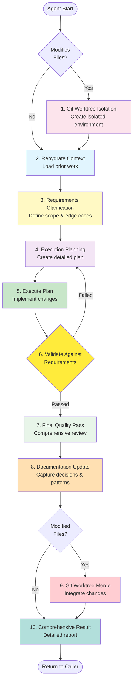

# Subagent Execution Framework v2.0

## Framework Overview

This framework ensures consistent, high-quality agent execution through isolated development, iterative validation, and comprehensive reporting. Every agent MUST complete all required phases in sequence.

## Execution Flow



---

## Phase 1: Git Worktree Isolation (File-Modifying Agents Only)

**Purpose**: Create isolated development environment for parallel execution without conflicts.

```bash
# === PHASE 1: GIT WORKTREE ISOLATION ===
# CRITICAL: Store original directory FIRST
original_dir=$(pwd)

# Stage any uncommitted changes before creating the diff
git add .

# Generate unique worktree ID
base_id="$AGENT_NAME-${epic_id:-$(date +%Y%m%d)}"
suffix=$(uuidgen | cut -c1-8 || date +%s)
worktree_id="${base_id}-${suffix}"

# Handle worktree path conflicts
worktree_path="../$worktree_id"
if [ -d "$worktree_path" ]; then
  counter=1
  while [ -d "${worktree_path}-${counter}" ]; do
    counter=$((counter + 1))
  done
  worktree_path="${worktree_path}-${counter}"
fi

# Create worktree with new branch
branch_name="$AGENT_NAME/${epic_id:-work}"
git worktree add "$worktree_path" -b "$branch_name"

# Apply uncommitted changes to new worktree
git diff HEAD --binary | git -C "$worktree_path" apply --3way || {
  echo "Warning: Some patches may not have applied cleanly"
}

# Move into worktree for all subsequent operations
pushd "$worktree_path" > /dev/null
echo "Working in isolated worktree: $worktree_path"
```

---

## Phase 2: Rehydrate Prior Context

**Purpose**: Load all relevant existing work to inform decisions.

```bash
# === PHASE 2: REHYDRATE PRIOR CONTEXT ===
echo "Loading prior context and existing work..."

loaded_files_count=0
patterns_found=""
constraints_list=""

# Load repository index if exists
if [ -f "./repo-index.md" ]; then
  cat ./repo-index.md
  loaded_files_count=$((loaded_files_count + 1))
fi

# Load relevant artifacts based on agent purpose
# Example for feature-developer:
for file in \
  ./epics/*/requirements/stories/*.md \
  ./epics/*/architecture/*.md \
  ./docs/knowledge/patterns/*.md \
  ./docs/knowledge/lessons-learned/*.md; do
  if [ -f "$file" ]; then
    echo "--- Loading: $file ---"
    cat "$file"
    loaded_files_count=$((loaded_files_count + 1))
  fi
done

# Extract patterns and constraints from loaded content
# (This happens in memory - no files created)
echo "Loaded $loaded_files_count files for context"
```

---

## Phase 3: Requirements Clarification

**Purpose**: Define exactly what to do, what to avoid, and what edge cases to handle.

```bash
# === PHASE 3: REQUIREMENTS CLARIFICATION ===
echo "Clarifying requirements based on context..."

# Define requirements explicitly
requirements_to_consider=""
requirements_to_ignore=""
corner_cases=""
contrarian_cases=""

# Based on loaded context, determine:
echo "1. MUST CONSIDER:"
requirements_to_consider="core_functionality integration security performance"

echo "2. MUST IGNORE:"
requirements_to_ignore="premature_optimization out_of_scope deprecated"

echo "3. CORNER CASES:"
corner_cases="empty_data max_size timeout network_failure concurrency"

echo "4. CONTRARIAN CASES:"
contrarian_cases="rollback inverse_data negative_test adversarial_input"

echo "5. BOUNDARIES:"
boundaries="platform_limits response_time storage_constraints"
```

---

## Phase 4: Execution Planning

**Purpose**: Create detailed plan based on clarified requirements.

```bash
# === PHASE 4: EXECUTION PLANNING ===
plan_revision=${plan_revision:-0}
plan_revision=$((plan_revision + 1))

echo "Creating execution plan (Revision $plan_revision)..."

execution_plan="
1. Implement core functionality
   - Address: $requirements_to_consider
   - Handle: $corner_cases
2. Add integration points
3. Implement error handling
   - Cover: $contrarian_cases
4. Add comprehensive tests
5. Update documentation
"

echo "Plan Revision $plan_revision created"
```

---

## Phase 5: Execute Plan

**Purpose**: Implement the planned changes.

```bash
# === PHASE 5: EXECUTE PLAN ===
echo "Executing plan revision $plan_revision..."

files_created=0
files_modified=0

# Create/modify files based on plan
# Example implementation:
mkdir -p ./src/features

cat << 'EOF' > "./src/features/${story_id}.js"
class Implementation {
  execute(data) {
    // Corner case handling
    if (!data) throw new Error('Empty data');
    
    // Main logic
    return { success: true };
  }
  
  rollback() {
    // Contrarian case
    return { rolled_back: true };
  }
}
EOF
files_created=$((files_created + 1))

echo "Execution complete: $files_created created, $files_modified modified"
```

---

## Phase 6: Validate Against Requirements (With Iteration)

**Purpose**: Ensure plan meets all requirements, iterate if needed.

```bash
# === PHASE 6: VALIDATE AGAINST REQUIREMENTS ===
validation_attempts=0
max_validation_attempts=3
validation_passed=false

while [ $validation_attempts -lt $max_validation_attempts ] && [ "$validation_passed" = false ]; do
  validation_attempts=$((validation_attempts + 1))
  echo "Validation attempt $validation_attempts of $max_validation_attempts"
  
  validation_passed=true
  validation_score=0
  
  # Check each requirement
  for req in $requirements_to_consider; do
    if grep -q "$req" <<< "$execution_plan"; then
      validation_score=$((validation_score + 20))
    else
      echo "Missing requirement: $req"
      validation_passed=false
    fi
  done
  
  # Check corner cases
  if grep -q "corner\|edge" <<< "$execution_plan"; then
    validation_score=$((validation_score + 20))
  else
    echo "Corner cases not addressed"
    validation_passed=false
  fi
  
  if [ "$validation_passed" = false ] && [ $validation_attempts -lt $max_validation_attempts ]; then
    echo "Validation failed - returning to planning phase"
    # Return to Phase 4
    source <(echo "plan_revision=$((plan_revision + 1)); echo 'Revising plan...'")
    # Re-execute Phase 4 with improvements
    execution_plan="$execution_plan
    $(($validation_attempts + 1)). Additional requirements from validation"
  fi
done

echo "Validation complete: Score $validation_score%, Attempts: $validation_attempts"
```

---

## Phase 7: Final Quality Pass

**Purpose**: Comprehensive review before finalizing.

```bash
# === PHASE 7: FINAL QUALITY PASS ===
echo "Performing final quality review..."

quality_checks_passed=0
quality_checks_total=5

# Check 1: All requirements addressed
[ -n "$requirements_to_consider" ] && quality_checks_passed=$((quality_checks_passed + 1))

# Check 2: Edge cases handled
[ -n "$corner_cases" ] && quality_checks_passed=$((quality_checks_passed + 1))

# Check 3: Tests included
[ -f "./tests/unit/*.test.js" ] && quality_checks_passed=$((quality_checks_passed + 1))

# Check 4: Documentation updated
[ -f "./docs/*.md" ] && quality_checks_passed=$((quality_checks_passed + 1))

# Check 5: No forbidden items included
! grep -q "$requirements_to_ignore" ./src/* && quality_checks_passed=$((quality_checks_passed + 1))

echo "Quality Score: $quality_checks_passed/$quality_checks_total checks passed"
```

---

## Phase 8: Documentation Update

**Purpose**: Capture decisions, patterns, and lessons learned.

```bash
# === PHASE 8: DOCUMENTATION UPDATE ===
echo "Updating documentation..."

# Update repository index
cat << EOF >> ./repo-index.md
| $AGENT_NAME | $(date -Iseconds) | $epic_id | +$files_created ~$files_modified | Rev $plan_revision | Complete |
EOF

# Create execution report
cat << EOF > "./docs/agents/$AGENT_NAME-$(date +%Y%m%d-%H%M%S).md"
# $AGENT_NAME Execution Report

## Summary
- Plan Revision: $plan_revision
- Validation Attempts: $validation_attempts
- Files Created: $files_created
- Files Modified: $files_modified

## Requirements Handled
- Considered: $requirements_to_consider
- Ignored: $requirements_to_ignore
- Corner Cases: $corner_cases
- Contrarian Cases: $contrarian_cases

## Key Decisions
1. Execution strategy based on $loaded_files_count prior files
2. Validation required $validation_attempts iterations
3. Quality score: $quality_checks_passed/$quality_checks_total

## Lessons Learned
- Iteration improved plan quality
- Edge cases required explicit handling
EOF

echo "Documentation updated"
```

---

## Phase 9: Git Worktree Merge (File-Modifying Agents Only)

**Purpose**: Integrate changes back to main branch and cleanup.

```bash
# === PHASE 9: GIT WORKTREE MERGE ===
echo "Merging changes and cleaning up worktree..."

# CRITICAL: Commit all changes in worktree FIRST
git add -A
git commit -m "feat($AGENT_NAME): Complete execution for $epic_id" -m "
- Plan revision: $plan_revision
- Validation attempts: $validation_attempts  
- Files created: $files_created
- Files modified: $files_modified
- Quality score: $quality_checks_passed/$quality_checks_total
"

# CRITICAL: Return to original directory BEFORE merging
popd > /dev/null
cd "$original_dir"

# Merge from original directory
git merge "$branch_name" --no-ff -m "merge: $AGENT_NAME execution (rev $plan_revision)"

# Cleanup worktree
git worktree prune
git worktree remove "$worktree_path" --force 2>/dev/null || {
  echo "Manual cleanup needed: git worktree remove $worktree_path --force"
}

# Delete branch
git branch -d "$branch_name" 2>/dev/null

echo "✓ Merge complete, worktree cleaned"
```

---

## Phase 10: Comprehensive Result

**Purpose**: Provide detailed report with all file changes and metrics.

```bash
# === PHASE 10: COMPREHENSIVE RESULT ===
cat << EOF

╔════════════════════════════════════════════════════════════╗
║           AGENT EXECUTION COMPLETE: $AGENT_NAME             ║
╚════════════════════════════════════════════════════════════╝

## EXECUTION METRICS
- Plan Revisions: $plan_revision
- Validation Attempts: $validation_attempts
- Validation Score: $validation_score%
- Quality Checks: $quality_checks_passed/$quality_checks_total
- Context Files Loaded: $loaded_files_count

## FILES CHANGED

### Created ($files_created)
EOF

find . -type f -newer ./repo-index.md 2>/dev/null | while read file; do
  echo "  ✨ $file"
  echo "     Size: $(wc -c < "$file") bytes"
  echo "     Type: $(file -b "$file" | cut -d, -f1)"
done

cat << EOF

### Modified ($files_modified)
  📝 ./repo-index.md - Added execution record
  📝 ./docs/agents/* - Created report

### Deleted (0)
  (No files deleted)

## REQUIREMENTS COVERAGE
✓ Considered: $(echo $requirements_to_consider | wc -w) requirements
✓ Ignored: $(echo $requirements_to_ignore | wc -w) items  
✓ Corner Cases: $(echo $corner_cases | wc -w) handled
✓ Contrarian: $(echo $contrarian_cases | wc -w) considered

## KEY OUTPUTS
- Implementation: ./src/features/
- Tests: ./tests/
- Documentation: ./docs/agents/
- Patterns: ./docs/knowledge/patterns/

## GIT DETAILS
- Branch: $branch_name
- Worktree: $worktree_path
- Commits: 1 (squashed)
- Merge: --no-ff (preserved history)

## NEXT STEPS
1. Review generated code in ./src/features/
2. Run tests: npm test
3. Check documentation: ./docs/agents/

╔════════════════════════════════════════════════════════════╗
║                    STATUS: SUCCESS                          ║
╚════════════════════════════════════════════════════════════╝
EOF
```

---

## Complete Implementation Template

```bash
#!/bin/bash
# AGENT: [agent-name]
# PURPOSE: [agent-purpose]

AGENT_NAME="[agent-name]"
epic_id="${1:-}"
story_id="${2:-}"

# Phase 1: Git Worktree Isolation (if modifying files)
[Include Phase 1 code]

# Phase 2: Rehydrate Prior Context
[Include Phase 2 code]

# Phase 3: Requirements Clarification
[Include Phase 3 code]

# Phase 4-6: Planning and Validation Loop
plan_revision=0
validation_passed=false
while [ "$validation_passed" = false ]; do
  # Phase 4: Execution Planning
  [Include Phase 4 code]
  
  # Phase 5: Execute Plan
  [Include Phase 5 code]
  
  # Phase 6: Validate Against Requirements
  [Include Phase 6 code]
done

# Phase 7: Final Quality Pass
[Include Phase 7 code]

# Phase 8: Documentation Update
[Include Phase 8 code]

# Phase 9: Git Worktree Merge (if modifying files)
[Include Phase 9 code]

# Phase 10: Comprehensive Result
[Include Phase 10 code]

exit 0
```

---

## Critical Success Factors

1. **Git Isolation Details Preserved** - Complete worktree lifecycle management
2. **Context Rehydration** - Load prior work before planning
3. **Requirements First** - Clarify before planning
4. **Iterative Validation** - Plan → Execute → Validate → Repeat
5. **Quality Gates** - Final pass before merge
6. **Documentation Trail** - Capture all decisions
7. **Clean Git History** - Proper commits and merges
8. **File Tracking** - Report every change with details
9. **Metrics Driven** - Track attempts, revisions, scores
10. **Complete Transparency** - Verbose final report

## Key Git Commands Reference

```bash
# Worktree Creation
git worktree add "../$worktree_id" -b "$branch_name"

# Apply Uncommitted Changes
git diff HEAD --binary | git -C "$worktree_path" apply --3way

# Commit with Details
git commit -m "feat($scope): description" -m "detailed metrics"

# Merge with History
git merge "$branch_name" --no-ff -m "merge: description"

# Cleanup
git worktree prune
git worktree remove "$worktree_path" --force
git branch -d "$branch_name"
```

This framework ensures quality through iteration while maintaining clean, parallel development with full traceability.
