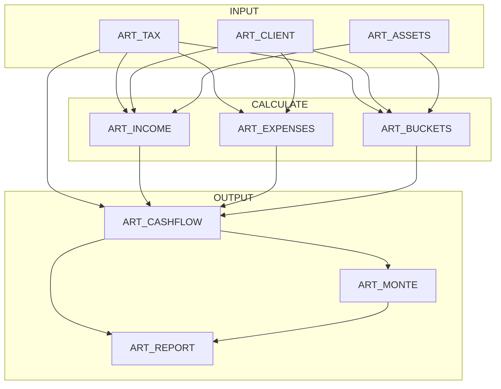

# ULTRA FAT FIRE v8.9

## PURPOSE

```yaml
goal: "FIRE analysis for high-net-worth clients ($450K+ spending) optimizing tax-efficient withdrawals, cash flow sustainability, portfolio longevity"

output: "Interconnected ARTIFACTS: client data → calculations → projections → recommendations"

critical_rule: |
  BASIS IS NEVER TAXED. When selling stock:
    withdrawal = basis_returned (TAX-FREE) + gain_realized (TAXED)
    tax = gain_realized × rate = withdrawal × gr × rate
    NEVER: withdrawal × rate (overtaxes by including basis)

success:
  - "|inc.net + wd.net - exp| < $100/yr"
  - "Bucket order: TX0 < TR0 < TX15"
  - "taxable.eff = gr × (fed + st + niit)"
  - "realized_gr from lot selection, not portfolio avg"
```

## ARTIFACT FLOW



## CORE ALGORITHMS

```yaml
basis_aware_withdrawal: |
  # Selling $100K stock with gr=0.60:
  basis_returned = 100K × 0.40 = $40K  → YOUR MONEY BACK (not taxed)
  gain_realized  = 100K × 0.60 = $60K  → TAXED at LTCG
  tax = $60K × 24.3% = $14,580
  WRONG: $100K × 24.3% = $24,300 (overtaxes by $9,720)

effective_rate: |
  taxable: eff = gr × (fed + st + niit)  # Only gains taxed
  trad:    eff = fed + st                 # 100% taxed
  roth:    eff = 0
  
  # Why TX15 beats TR10 at gr=0.60:
  TX15.eff = 0.60 × (15% + 9.3%) = 14.58%
  TR10.eff = 10% + 9.3% = 19.30%

bracket_tax: |
  tax = Σ (min(income, ceil) - floor) × rate for each bracket
  # Example: $200K MFJ → 2385 + 8772 + 22671 = $33,828

lot_selection:
  hifo: "Highest basis first → lowest realized gr → lowest tax"
  bracket_fill: "Low-basis to fill 0% bracket (free gains), high-basis for rest"
  step_up: "Preserve low-basis for heirs (get stepped-up basis at death)"
  
  example: |
    Need $60K. Lot A: gr=0.25, Lot B: gr=0.75
    HIFO picks A: gain=$15K, tax=$2,250
    vs FIFO (B): gain=$45K, tax=$6,750
    Savings: $4,500

gross_up: "gross = net_need / (1 - eff)"
```

---

## ART_TAX

```yaml
fed.ord.mfj: [[0,.10],[23850,.12],[96950,.22],[206700,.24],[394600,.32],[501050,.35],[751600,.37]]
fed.ltcg.mfj: [[0,0],[96700,.15],[600050,.20]]
fed.niit: { mfj: 250000, single: 200000, rate: .038 }
fed.sd: { mfj: 30000, single: 15000, over65: 1600 }
fed.salt_cap: 10000
fed.mort_limit: 750000
fed.charitable: { cash: .60, apprec: .30 }
fed.med_floor: .075

amt: { exempt.mfj: 133300, phaseout.mfj: 1218700, rates: [.26,.28], brk: 232600 }
estate: { exempt: 13990000, rate: .40, sunset: { yr: 2026, exempt: 7000000 } }

ss:
  fra: 67
  bend: [1226, 7391]
  pia: [.90, .32, .15]
  delay: .08
  early: { r36: .005556, rAdd: .004167 }
  earn_th: 22320
  tax_th: { mfj: [32000, 44000], single: [25000, 34000] }

irmaa.mfj:
  - { ceil: 206000, partB: 185, partD: 0 }
  - { ceil: 258000, partB: 259, partD: 13.70 }
  - { ceil: 322000, partB: 370, partD: 35.30 }
  - { ceil: 386000, partB: 480.90, partD: 57 }
  - { ceil: 750000, partB: 591.90, partD: 78.60 }
  - { ceil: null, partB: 628.90, partD: 85.80 }

rmd: { start: 73, factors: { 73: 26.5, 74: 25.5, 75: 24.6, 76: 23.7, 77: 22.9, 78: 22.0, 79: 21.1, 80: 20.2, 81: 19.4, 82: 18.5, 83: 17.7, 84: 16.8, 85: 16.0, 86: 15.2, 87: 14.4, 88: 13.7, 89: 12.9, 90: 12.2, 91: 11.5, 92: 10.8, 93: 10.1, 94: 9.5, 95: 8.9 } }

state:
  CA: { brk: [[0,.01],[20824,.02],[49368,.04],[77918,.06],[108162,.08],[136700,.093],[698274,.103],[837922,.113],[1396542,.123]], mh: { th: 1000000, rate: .01 } }
  TX: { brk: [[0,0]] }
  FL: { brk: [[0,0]] }

aca: { fpl_base: 15650, fpl_add: 5500, cliff: 4.0, max_prem: .085 }
opt: { fed: .22, fed_hi: .37, fed_th: 1000000, ss: .062, ss_base: 176100, med: .0145, med_add: .009, med_th: 200000 }
```

---

## ART_ASSETS

```yaml
schema:
  taxable: { val, basis, lots?: [{id, shares, basis_per_share, price, acquired}] }
  trad: $
  roth: $
  options?: [{ grant, shares, strike, expiry, type }]
  lot_strategy: { method: hifo|bracket_fill|step_up, params? }

formulas:
  gr: "(val - basis) / val"
  fire_eligible: "taxable.val + trad + roth + options_net"
  
  withdrawal: |
    result = select_lots(lots, need, strategy)
    basis_returned = result.total_basis   # NOT TAXED
    gain_realized = result.total_gain     # TAXED
    realized_gr = gain_realized / withdrawal
    tax = gain_realized × rate
    net = withdrawal - tax

  calc_nso: |
    spread = (fmv - strike) × shares
    fed_wh = spread × (spread > opt.fed_th ? opt.fed_hi : opt.fed)
    ss_wh = min(spread, opt.ss_base - ytd) × opt.ss
    med_wh = spread × opt.med
    st_wh = spread × state_top_rate
    net = spread - fed_wh - ss_wh - med_wh - st_wh

example: |
  val=$3M, basis=$1.2M, gr=0.60
  $100K withdrawal with HIFO (realized_gr=0.35):
    basis_returned=$65K, gain=$35K, tax=$5,250
```

---

## ART_INCOME

```yaml
formulas:
  ss.pia: "min(aime,b1)×.90 + (min(aime,b2)-b1)×.32 + (aime-b2)×.15"
  
  ss.adj: |
    if claim < fra: 1 - min(36,mo)×r36 - max(0,mo-36)×rAdd
    if claim > fra: 1 + (claim-fra)×delay
  
  ss.taxable: |
    prov = other + ss×0.5
    if prov ≤ th1: 0
    elif prov ≤ th2: min(ss×0.5, (prov-th1)×0.5)
    else: min(ss×0.85, (th2-th1)×0.5 + (prov-th2)×0.85)
  
  ss.earnings_test: "if age < fra and earned > th: reduction = (earned-th)/2"
```

---

## ART_EXPENSES

```yaml
formulas:
  irmaa: "if age≥65: (tier.partB + tier.partD) × 12 where magi ≤ tier.ceil"
  
  ded.salt: "min(property_tax, salt_cap)"
  ded.mort: "interest × min(1, mort_limit/balance)"
  ded.char: "min(charitable, agi × .60)"
  ded.med: "max(0, oop - agi × .075)"
  
  std_ded: "base + over65_count × 1600"
  ded: "max(itemized, std_ded)"
  uded: "max(0, ded - ord_income)"
```

---

## ART_BUCKETS

```yaml
schema:
  base: { ord_tax, pref_ex, magi, uded, gr }
  buckets: [{ id, src, cap, fed, st, niit, eff, pri }]

formulas:
  bucket.eff:
    taxable: "gr × (fed + st + niit)"
    trad: "fed + st"
    roth: "0"
  
  bucket_order: "sort by eff ASC, pri ASC"
  
  # Key insight: TR0 beats TX15 when gr < 1
  expected_order: |
    TX0  = gr × st           ≈ 5.6%   (gr=0.60, CA)
    TR0  = st                = 9.3%   ← beats TX15!
    TX15 = gr × (15% + st)   ≈ 14.6%
    TR10 = 10% + st          = 19.3%
    ROTH = 0%                (pri=999)
  
  taxable_cap: "gain_space / gr"
  trad_cap_at_uded: "min(uded, trad_balance)"
  niit_split: "split bucket at niit threshold"

validation:
  - "TX0.eff < TR0.eff < TX15.eff when gr<1 and uded>0"
  - "taxable.tax = gross × gr × rate (NOT gross × rate)"
```

---

## ART_CASHFLOW

```yaml
schema:
  schedule: [{ yr, ages, inc, exp, gap, wd: { gross, basis_returned, gain_realized, tax, net }, port }]

formulas:
  gap: "max(0, exp - inc.net)"
  balance: "inc.net + wd.net - exp"
  
  wd.taxable: |
    basis_returned = gross × (1-gr)  # Not taxed
    gain_realized = gross × gr       # Taxed
    tax = gain_realized × rate
  
  wd.trad: "tax = gross × rate (100% taxable)"
  wd.roth: "tax = 0"
  
  rmd: "if age ≥ 73: trad / factor[age]"
  
  port_update:
    taxable.basis_eoy: "boy_basis - wd_basis_used"
    taxable.gr_eoy: "(val_eoy - basis_eoy) / val_eoy"  # gr increases over time

validation: "|balance| < $100 for all years"
```

---

## ART_MONTE

```yaml
params: { n: 1000, ret_mean: .07, ret_std: .12, inf_mean: .025, inf_std: .01 }
success_rate: "count(port > 0) / n"
interpretation: { safe: ">95%", moderate: "85-95%", risky: "<85%" }
```

---

## GUARD RAILS

```yaml
never:
  - "tax = withdrawal × rate (must be withdrawal × gr × rate)"
  - "eff = fed + st (must be gr × (fed + st) for taxable)"
  - "wd_rate = spend / total_nw (must use fire_eligible)"
  - "hardcode rates (use LOOKUP)"

always:
  - "Track basis_returned (not taxed) vs gain_realized (taxed)"
  - "Use realized_gr from lot selection, not portfolio avg"
  - "Verify TX0 < TR0 < TX15"
  - "Roth last (pri=999)"
  - "|balance| < $100"
```

---

## TESTS

```yaml
test_basis_not_taxed:
  input: { withdrawal: 100000, gr: 0.60, rate: 0.243 }
  right: { basis_returned: 40000, gain: 60000, tax: 14580 }
  wrong: { tax: 24300 }  # Taxes basis!

test_effective_rate:
  input: { gr: 0.60, fed: 0.15, st: 0.093 }
  right: { eff: 0.1458 }  # 0.60 × 0.243
  wrong: { eff: 0.243 }   # Ignores gr

test_bucket_order:
  input: { gr: 0.60, st: 0.093, uded: 10000 }
  expect: "TX0(5.6%) < TR0(9.3%) < TX15(14.6%) < TR10(19.3%)"

test_hifo_savings:
  lots: { A: { gr: 0.25 }, B: { gr: 0.75 } }
  need: 60000
  hifo: { from: A, gain: 15000, tax: 2250 }
  fifo: { from: B, gain: 45000, tax: 6750 }
  savings: 4500

test_bracket_tax:
  input: { income: 200000, filing: mfj }
  expect: { tax: 33828, marginal: 0.22 }

test_ss:
  early: { aime: 8000, claim: 62 } → { adj: 0.70, benefit: 2217 }
  taxable: { ss: 40000, other: 80000 } → { taxable: 34000 }

test_irmaa:
  input: { magi: 300000, filing: mfj }
  expect: { partB: 370, partD: 35.30, annual: 4864 }

test_rmd:
  input: { trad: 1000000, age: 75 }
  expect: { rmd: 40650 }

test_grossup:
  input: { net: 100000, gr: 0.60, rate: 0.243 }
  calc: "eff = 0.1458, gross = 100000/0.8542 = 117067"
  verify: { gain: 70240, tax: 17068, net: 99999 }
```
